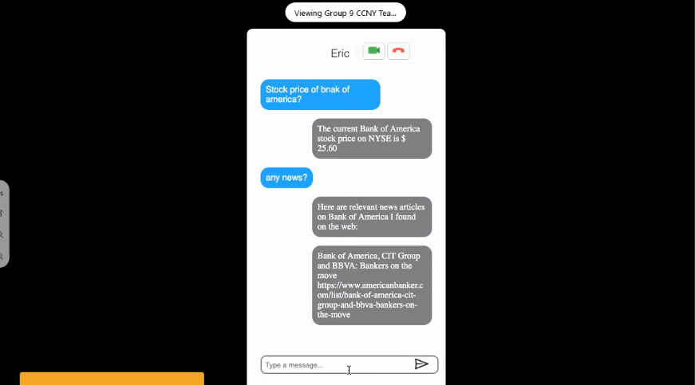
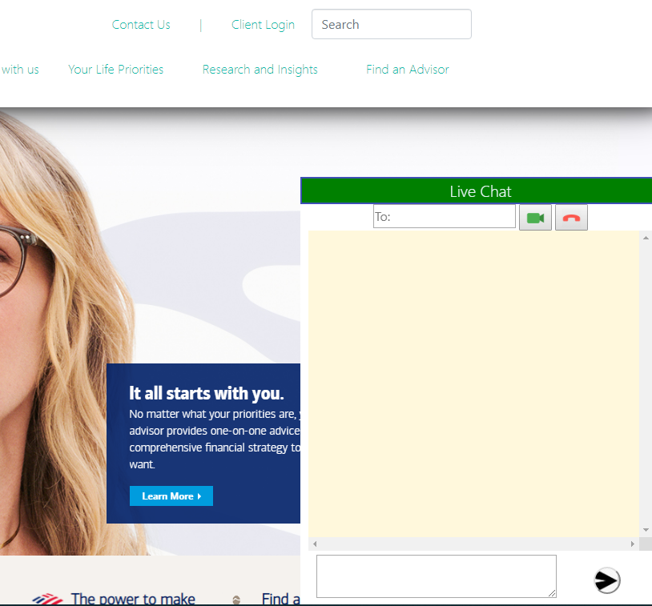

***Bank of America Student Engagement***

Contributors: **Team SSH**

**Inspiration**
A chat-bot that would guide beginners or experts find investment learning resources that are aimed towards their experience level. Catered towards beginners educational resources such as videos and lessons would provide a smooth start.
There are some questions which resources may not answer directly and in those times it’s best to speak directly with someone who knows about investing. Users will also have the ability to chat, speak, or even video call one-on-one with a investment representative, and make an appointment at a local branch via the chatbot.

*Chat bot stock predictions*          | *Representatve chat system with video calling*
:-------------------------:|:-------------------------:
  |  

## Notes

Developed with Html/Css/Javascript, AGORA API, IBN Watson Chat Bot

## License

    Copyright [yyyy] [name of copyright owner]

    Licensed under the Apache License, Version 2.0 (the "License");
    you may not use this file except in compliance with the License.
    You may obtain a copy of the License at

        http://www.apache.org/licenses/LICENSE-2.0

    Unless required by applicable law or agreed to in writing, software
    distributed under the License is distributed on an "AS IS" BASIS,
    WITHOUT WARRANTIES OR CONDITIONS OF ANY KIND, either express or implied.
    See the License for the specific language governing permissions and
    limitations under the License.

